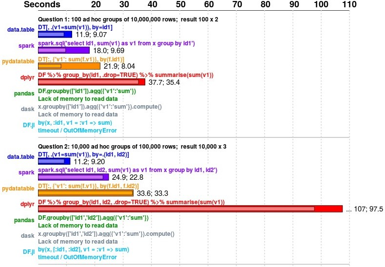

# Speed {#speed}

> You are officially a programmer the day you have learned basics of R programming. People will expect you to know programming concepts And It will all come naturally to you over time.

***
  
  Please Watch this video before reading anything else. It's a must watch video for anybody trying to learn programming.

<iframe width="560" height="315" src="https://www.youtube.com/embed/JEpsKnWZrJ8" frameborder="0" allowfullscreen></iframe>

 

Data.table is the fastest package in R. There is no doubt about it. Everybody in R knows this fact and respect it. Even Pandas doesn't stand a chance against data.table. If you really want to see the power of this package you should definetly [click here to see benchmarks](https://h2oai.github.io/db-benchmark/). It is the most comprehensive benchmark on almost all the packages in all the languages from R to python and even julia. This is something I always show to my friends who tell me python is faster than R.

 

In R people are constantly told that saving a few miliseconds is no good. But if you use a package that save a few miliseconds on every (shft + enter) you press. And you use R everyday for a few years. How many hours will you save simple by switching to a different package. I don't want to hypothetically calculate it but hope you get the picture. And to top it off your code is almost always ready for production. Because it will be the fastest. That will help especially when you want to create a shiny app or a plumber API. As a programmer you should be able to utilize full resources of a computer.